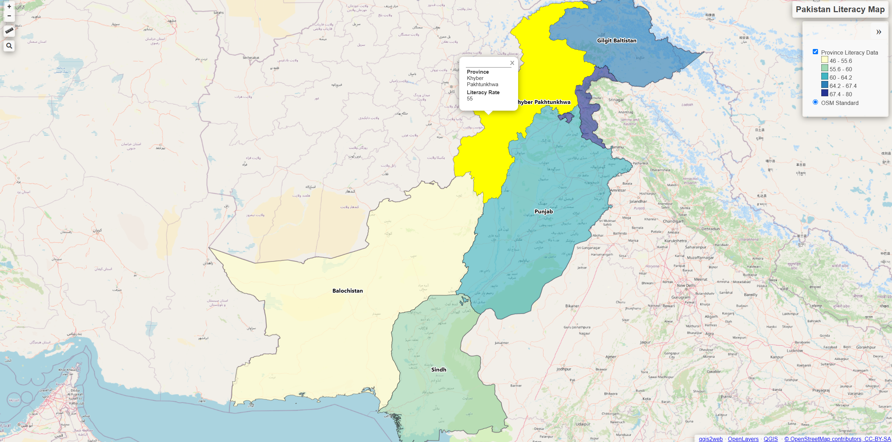

# Pakistan Literacy Map (Practice Project)

This is a **map of Pakistan created in QGIS** to visualize the **literacy rate across regions**.  
The data used is **simulated** and for **practice purposes only** — it does not reflect official statistics.

🔗 **View the interactive map here**:  
[https://nmalikk.github.io/geo-map-work/](https://nmalikk.github.io/geo-map-work/)

## Screenshot

