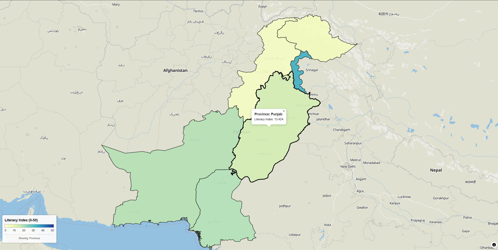
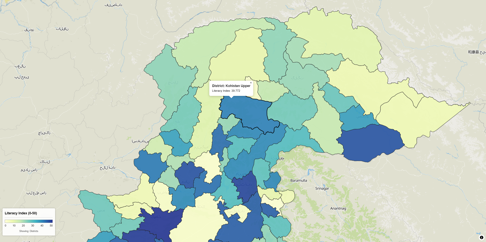

# Pakistan Literacy Map (Practice Project)

This is a **map of Pakistan created in QGIS** to visualize the **literacy rate across regions**.  
The data used is **simulated** and for **practice purposes only** — it does not reflect official statistics.

🔗 **View the interactive map here**:  
[https://nmalikk.github.io/geo-map-work/](https://nmalikk.github.io/geo-map-work/)

**Note:**
The UI on this website is very basic and can be improved by putting the data layer between the basemap and key objects like roads and rivers. This would allow the roads and rivers to be visible over the data layer therefore enhancing the final look and visibility. To check out what that would look like, [visit my LinkedIn](https://www.linkedin.com/in/muhammad-nafees-286331254/) profile experience section to see visuals of my latest work on a project similar to this.
## Screenshot

